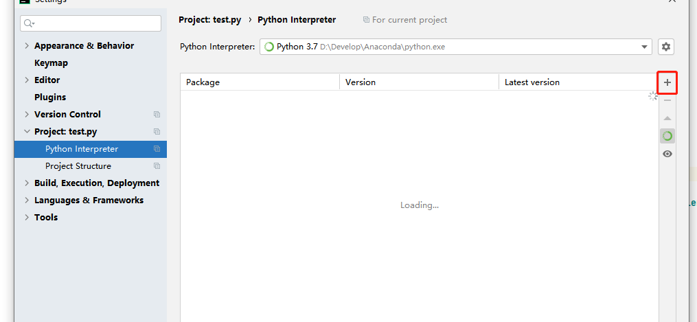

# gdgbpx_auto
## 广东省干部培训网络学院自动挂视频学分脚本

### 前言
最近在帮人挂广东省干部培训网络学院这个网站的视频，参考了一下网上别人的代码，自己也弄了一套，语言 **python**,需要python环境；

### 使用说明
1. 拉代码，python环境建议直接安装anaconda然后配置环境变量，然后直接下载pycharm开发工具，打开代码后，提示什么包下面有红色波浪线要import，就import；import失败就打开settings-Python Interpreter-install(+号)手动引入

   

2. 需要下载你当前电脑chrome谷歌浏览器对应版本的驱动，可查看当前浏览器，在网址http://npm.taobao.org/mirrors/chromedriver/  下载对应的驱动
    将下载好的驱动解压到对应chrome的安装目录路径，windows放在C:\Program Files (x86)\Google\Chrome\Application下，mac放在/usr/local/bin/下

3. 修改代码中用户名密码，在pycharm运行
```
 # 输入账号
    username = "****"
    # 输入密码
    passwd = "****"
```

4. 需要正常登录，选好课，选够五十学分的课程，不要选PPT，目前代码只支持自动打开视频，和自动播放视频，
5. 代码运行会根据浏览器驱动自动打开一个页面，会自动输入账号名和密码，然后弹框让你输入打开页面的那个验证码。然后就登陆成功。会一步一步打开视频播放，播放完会自动播放下一个
6. 暂时想到这么多，具体报错在百度错误内容是啥，有问题联系邮箱：zww7821270@163.com
